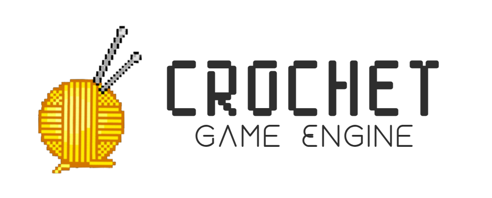
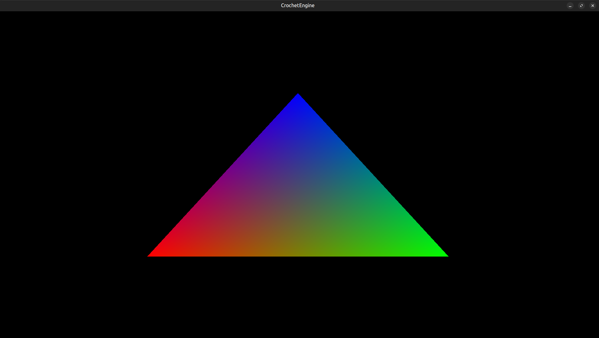
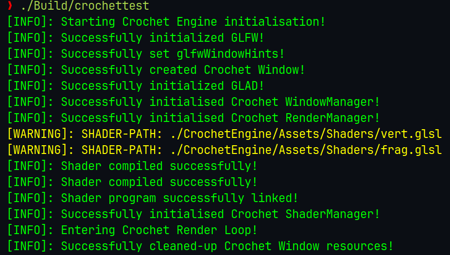

# Crochet Engine

## 2D cross-platform game engine

### ✅ Rendered a test triangle to validate the rendering pipeline.
### 🧱 The engine supports drawing other 2D primitives — triangle was just a demo.
### 🔄 Windows backend support is on the roadmap (currently runs on Linux).

---

## SCREENSHOTS:

